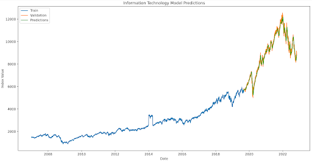
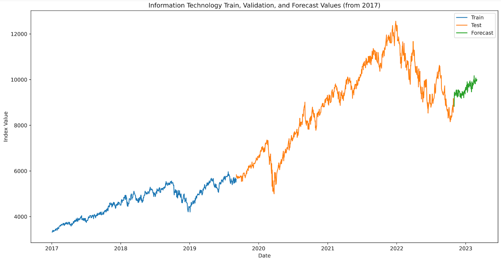

# Stock Market Predictions
By: Dom and Pranay

<b>Course: </b>CS 463 - Machine Learning | <b>Professor</b>: David Guy Brizan

Link to final presentation slides: https://docs.google.com/presentation/d/1SWThoOwOEdIcIeWmRG9j4CkstEbZu5YObayLIEWEif8/edit?usp=sharing

## Predictions of the Future

## Overview
### The Goal
    Determine the best stock market sector to invest till March 2023  based on past performance.

### Why?
    Investing in the stock market can be risky, especially investing into a single company. 
    
    However, this risk can be mitigated by investing into a sector instead of an individual stock.

### How?

    Gathering data and building an index on each of the 11 sectors:
        - Industrials
        - Financials
        - Health Care
        - Consumer Discretionary
        - Consumer Staples
        - Real Estate
        - Utilities
        - Materials
        - Communication Services
        - Energy
        - Information Technology
    Then training a machine learning model on the index we built for each 
    sector and using the model to predict the prices of each index in each
    sector 120 days into the future.

    For this project, we used an LSTM, a type of recurret neural network.

## The Code and Data for this Project
To obtain the data and train the model, follow these steps:
- Running `python get_data.py` will populate data in the `daily_share_price_data` and `outstanding_shares_data` directories.
- Running `python merge_sectors.py` will populate data in the `merged` directory.
- Running `python build_index.py` will populate data and PDF plots in the `indexes` directory.
- Running the `sector_index_predictions.ipynb` jupyter notebook will populate data and PDF plots in the  `predictions` directory.

## Python Libraries and Packages Used
- selenium: https://pypi.org/project/selenium/
- yfinance : https://pypi.org/project/yfinance/
- pandas: https://pandas.pydata.org/
- scikit-learn: https://scikit-learn.org/stable/
- matplotlib: https://matplotlib.org/
- tensorflow: https://www.tensorflow.org/
